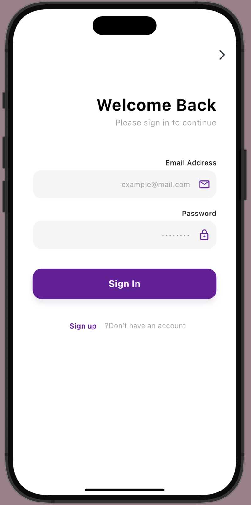
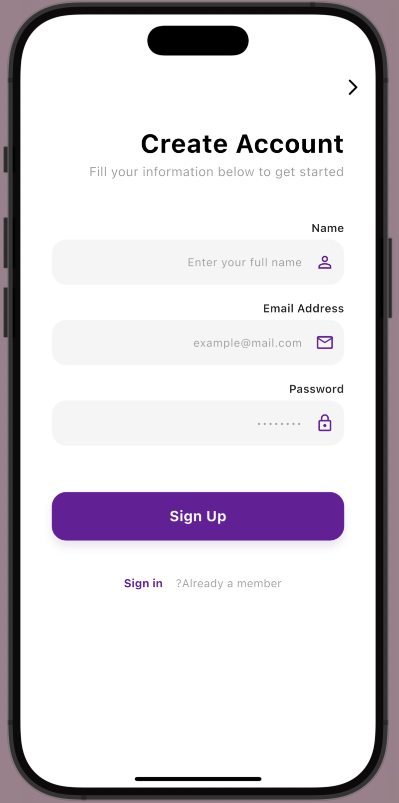
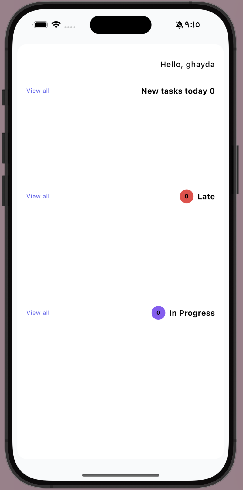
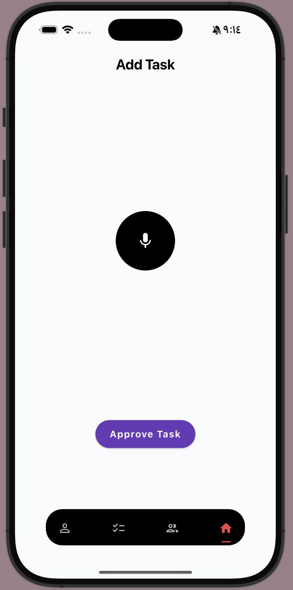
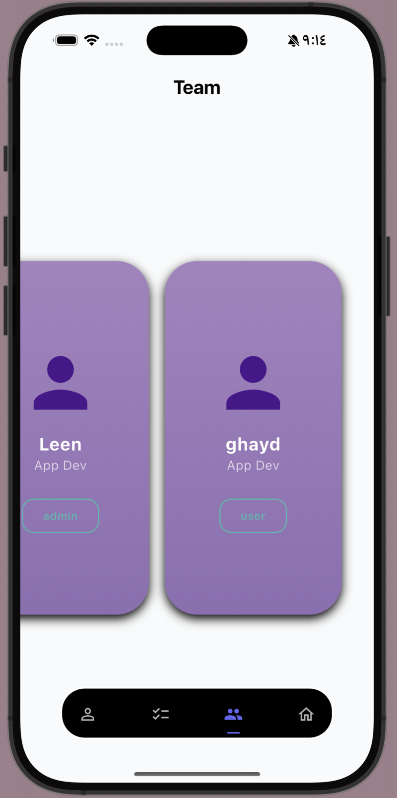
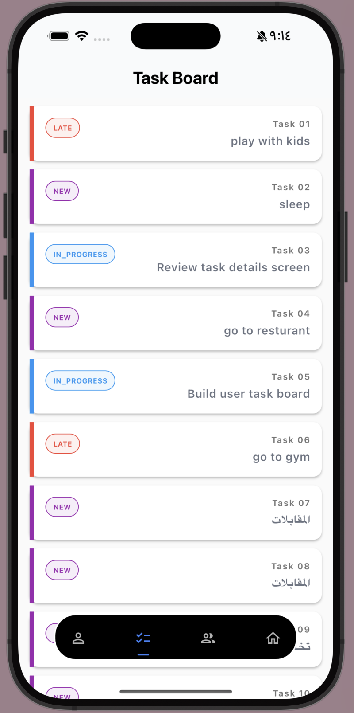
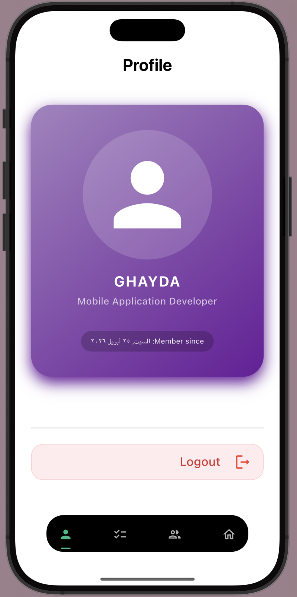

<div align="center">

# 🚀 VocaDo  
### 🎙️ Your AI-Powered Task Manager


> ✨ Speak. Understand. Execute.

---


</div>

---

## 🧠 Overview

**VocaDo** is a next-generation task management app that transforms **voice commands into structured, actionable tasks** using Artificial Intelligence.

Instead of typing tasks manually, users simply speak — and the system intelligently processes, understands, and assigns tasks.

---

## 🎯 Vision

> Build a system where **human language becomes system logic**

---

## ⚡ Features

### 🔐 Authentication & Roles
- Secure login via Supabase
- Role-based routing:
  - 🛠️ Admin → Voice Control
  - 👨‍💻 User → Task Dashboard

---


## 📊 Dashboard Experience

- Clean overview of tasks  
- Real-time status updates  
- Easy navigation between categories

  ---  

### 🎙️ AI Voice Processing (Admin)
- Record voice commands
- Convert speech → text
- AI analyzes intent
- Returns structured JSON:

```json
{
  "task": "Update the design in Figma",
  "assignee": "Leen",
  "due_date": "2026-04-23"
}
```

---

## 📱 App Screens

### 🔐 Authentication

<div align="center">
  
  
</div>

---

### 👤 User Experience

<div align="center">
  
</div>

> 📌 Users can view and track their assigned tasks easily

---

### 🛠️ Admin Panel

<div align="center">
  
  
  
  
</div>

> ⚙️ Admin has full control over tasks, team, and workflow

---

## Supabase Structure

```
┌──────────────────────┐
│   auth.users         │
│----------------------│
│ id (uuid) PK         │
│ email                │
│ password             │
└─────────┬────────────┘
          │ 1
          │
          │
          ▼
┌──────────────────────┐
│      users       │
│----------------------│
│ id (uuid) PK/FK      │◄──────────────┐
│ name text            │               │
│ email text           │               │
│ role user_role       │               │
│ created_at           │               │
└─────────┬────────────┘               │
          │ 1                         │ 1
          │                           │
          │                           │
   ┌──────┴──────────┐        ┌───────┴──────────┐
   ▼                 ▼        ▼                  ▼

        ┌──────────────────────────────┐
        │           tasks              │
        │------------------------------│
        │ id uuid PK                  │
        │ title text                  │
        │ assignee_id FK ─────────────┘ (users.id)
        │ created_by FK ──────────────┘ (users.id)
        │ due_date date               │
        │ status task_status          │
        │ created_at                  │
        └──────────────────────────────┘
```

## 👥 Team

<div align="center">

| 👤 Name         | 💼 Role      |
|----------------|-------------|
| Leen Alsaleh   | Developer   |
| Ghayda         | Developer   |
| Khaled         | Developer   |

</div>


